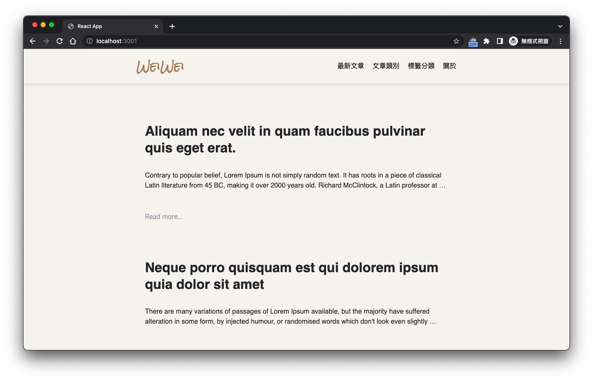

# 簡易個人部落格（前端）
這是一個基於使用React去假實作的部落格前端，以個人架設部落格的需求去設計。目前所串接的API皆是配合[後端專案](https://github.com/YINWEIHSU/blog-app-backend)使用。

環境
Nodejs: 18.13.0以上

## 安裝與執行

1. 安裝套件
    ```
    npm install
    ```
2. 建立.env檔案並設定環境變數，可參考.env.example進行設置
    ```
    REACT_APP_API_URL: 後端伺服器位址
    ```

3. 在終端機輸入下面指令即可成功執行。
    ```
    npm start
    ```

## 打包
可透過以下指令打包專案。
```
npm run build
```

## 使用
這裡說明的使用方式皆是以配合[後端專案](https://github.com/YINWEIHSU/blog-app-backend)使用的情境。
- 下面為一般使用者所見的畫面。

- 登入：因為是屬於個人使用，沒有在主畫面做登入連結，請直接在url加上`/login`進到登入頁面，登入後可進入首頁。


- 點擊首頁右上角圖示可發布新文章。
    文章以md格式進行編輯，會自動偵測第一個#字後面的文字作為標題。
    可於標籤輸入欄以#tag的形式新增標籤，每個標籤之間以空白鍵間隔。
    文章分類為必選，可於下拉式選單中新增。

- 點擊root字樣可以進入使用者資料更新頁面，於此頁面可修改顯示名稱及密碼。
- 點擊最新文章可以進到文章列表。

- 點擊文章分類可以看到所有分類，或可直接透過下拉式選單選擇分類文章。

- 點擊標籤分類可以看到所有標籤，可透過標籤選擇所有關聯文章。

- 關於頁面尚在施工中。